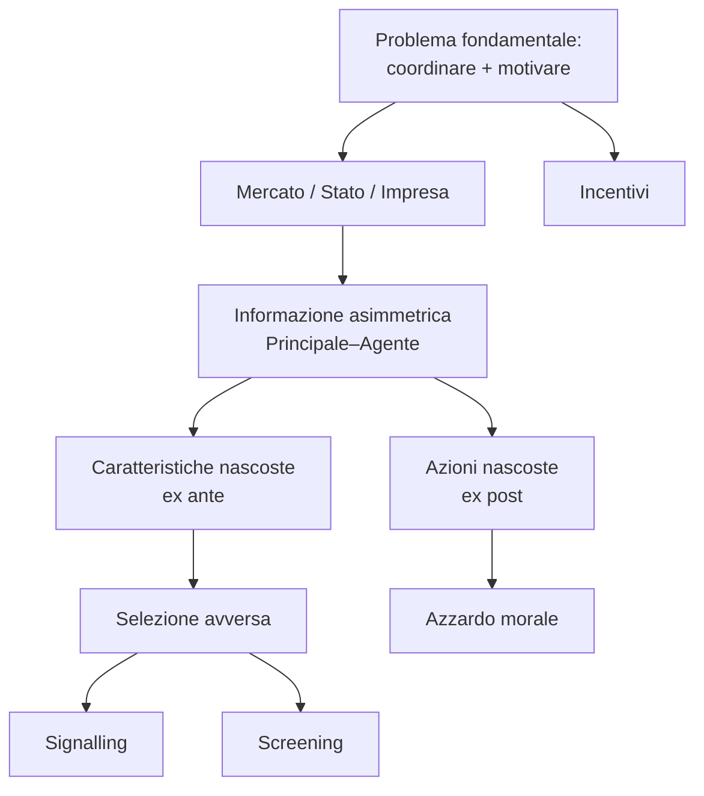

# 📚 Economia dell'Informazione — Introduzione

Mappa dei concetti (MOC, *Map of Content*) delle prime tre lezioni introduttive
del corso *Economics of Information* (Lezioni 1–3). Ogni nota tratta **un singolo
concetto**: definizione, intuizione, modello formale, esempi e riferimenti ai libri.

## 🗺️ Note

1. [[01_Coordinamento_e_incentivi]] — Il problema fondamentale: coordinare e motivare; il ruolo degli incentivi.
2. [[02_Mercato_e_Hayek]] — Il mercato come elaboratore di informazione; l'ipotesi di Hayek.
3. [[03_Beni_comuni]] — La tragedia dei *commons* e il dilemma del pescatore.
4. [[04_Principale_e_agente]] — Informazione asimmetrica: principale e agente; i tre scenari informativi.
5. [[05_Selezione_avversa]] — Caratteristiche nascoste → selezione avversa (il mercato dei *lemons*).
6. [[06_Segnalazione]] — *Signalling*: segnali costosi e credibili.
7. [[07_Screening]] — *Screening*: menù di contratti e discriminazione di prezzo.
8. [[08_Azzardo_morale]] — Azioni nascoste → azzardo morale e contratti ottimali.
9. [[09_Nobel]] — I premi Nobel per l'economia dell'informazione.

## 🧭 Filo conduttore

> [!abstract] La domanda centrale del corso
> Quali **scambi**, **comportamenti**, **contratti** e **istituzioni** emergono
> all'equilibrio quando l'informazione è **asimmetrica** e gli interessi sono
> **in conflitto**? Con quali conseguenze per l'**efficienza** e l'**esistenza**
> dei mercati?

## 📖 Legenda dei riferimenti bibliografici

| Sigla | Testo |
|-------|-------|
| **[BB]** | Birchler, U. & Bütler, M. — *Information Economics*, Routledge (2007) |
| **[C]** | Carmichael, F. — *A Guide to Game Theory*, Prentice Hall |
| **[KS]** | Kerschbamer, R. & Sutter, M. — *The Economics of Credence Goods – a Survey* |
| **[M]** | Molho, I. — *The Economics of Information*, Basil Blackwell |

> [!note] Nota sulle citazioni
> Le citazioni "Dal libro" da **[BB]**, **[C]** e **[KS]** riportano il numero di
> pagina. Il testo **[M]** (Molho) è disponibile solo come scansione (immagini
> senza livello di testo): viene quindi citato a livello tematico, senza numero
> di pagina.

---

## 🔗 Connessioni con la Teoria dei Giochi

Le note introduttive trovano nella [[1. GT/00_Indice|Teoria dei Giochi]] il loro apparato formale. La mappa dei collegamenti è la seguente:

| Tema — *Introduzione* | Strumento formale — *1. GT* |
|----------------------|----------------------------|
| [[01_Coordinamento_e_incentivi]] — il problema del coordinamento | [[1. GT/04_Giochi_Coordinamento]], [[1. GT/06_Dilemma_Prigioniero]] |
| [[02_Mercato_e_Hayek]] — il mercato come elaboratore di info | [[1. GT/03_Nash_Equilibrium]], [[1. GT/04_Giochi_Coordinamento]] |
| [[03_Beni_comuni]] — tragedia dei commons | [[1. GT/06_Dilemma_Prigioniero]], [[1. GT/01_Strategia_Dominante]] |
| [[04_Principale_e_agente]] — framework P–A | [[1. GT/07_Giochi_Dinamici_Sequenziali]], [[1. GT/03_Nash_Equilibrium]] |
| [[05_Selezione_avversa]] — caratteristiche nascoste | [[1. GT/07_Giochi_Dinamici_Sequenziali]], [[1. GT/06_Dilemma_Prigioniero]] |
| [[06_Segnalazione]] — signalling | [[1. GT/07_Giochi_Dinamici_Sequenziali]], [[1. GT/05_Chicken_Game]] |
| [[07_Screening]] — menù di contratti | [[1. GT/07_Giochi_Dinamici_Sequenziali]], [[1. GT/03_Nash_Equilibrium]] |
| [[08_Azzardo_morale]] — azioni nascoste | [[1. GT/06_Dilemma_Prigioniero]], [[1. GT/09_Giochi_Ripetuti_Indefiniti]], [[1. GT/10_Folk_Theorem]] |
| [[09_Nobel]] — storia del pensiero | [[1. GT/00_Indice]], [[1. GT/10_Folk_Theorem]] |
