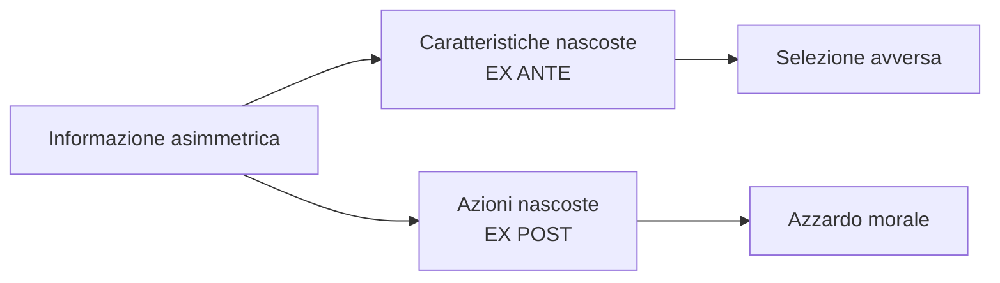

# Principale e agente: l'informazione asimmetrica

## Cos'è l'informazione

> [!definition] Informazione
> *Conoscenza o fatti appresi, in particolare su un certo soggetto o evento.*
> Nell'economia dell'informazione le due dimensioni rilevanti sono:
> - le **caratteristiche** (*characteristics*) → tipi nascosti, *ex ante*;
> - le **azioni** (*actions*) → comportamenti nascosti, *ex post*.

> [!quote] George Stigler (1961)
> «Knowledge is power. And yet it occupies a slum dwelling in the town of
> economics. Mostly it is ignored: the best technology is assumed to be known
> [...].» — È la citazione che apre la riflessione moderna sull'economia
> dell'informazione.

## Informazione privata → informazione asimmetrica

Quando una parte possiede **informazione privata** rilevante per la transazione,
nasce l'**informazione asimmetrica**. Esempi:

- Il **lavoratore** conosce le proprie abilità e azioni meglio del **datore**.
- I **produttori** conoscono la qualità dei beni meglio dei **consumatori**.
- Gli **imprenditori** conoscono i propri progetti/sforzi meglio degli **investitori**.
- Il **direttore** di una fabbrica conosce il processo produttivo meglio dei
  consumatori o dei residenti del quartiere.

## Principale e agente

> [!definition] Principale e Agente
> - **Principale** (*Principal*) = la parte **non informata** (*uninformed*).
> - **Agente** (*Agent*) = la parte **informata** (*informed*).
>
> ⚠️ Attenzione: questa è la convenzione adottata nel corso (basata sull'asimmetria
> informativa). In altri testi "principale" indica chi delega e "agente" chi
> esegue; i due ruoli possono non coincidere.

> [!example] L'officina meccanica: ruoli annidati
> - Il **proprietario dell'auto** (Principale-1) vuole un lavoro affidabile a basso
>   costo, ma non ha competenze né tempo per monitorare il meccanico.
> - Il **titolare del garage** (Agente-1) ha l'incentivo a fare profitti, ma anche
>   a **costruirsi una reputazione** e a battere i concorrenti.
> - Lo stesso titolare (Principale-2) deve assumere e motivare i propri **dipendenti**
>   (Agenti-2, 3, …, n).
>
> Lo stesso soggetto può essere insieme agente in una relazione e principale in
> un'altra. La reputazione (collegata a [[06_Segnalazione]]) attenua il conflitto.

## I tre scenari informativi

L'effetto dell'informazione dipende da **come** è distribuita. Il corso distingue
tre scenari (vedi anche [[02_Mercato_e_Hayek]] per i primi due):

> [!theorem] Tre scenari
> 1. **Informazione completa** → il sistema dei prezzi basta per raggiungere
>    l'efficienza paretiana (Primo Teorema del Benessere).
> 2. **Informazione incompleta ma simmetrica** (es. scambio di un asset il cui
>    valore è ignoto a tutti) → il Primo Teorema del Benessere **vale ancora** →
>    efficienza paretiana.
> 3. **Informazione incompleta e asimmetrica** (alcuni sanno più di altri) → il
>    mercato può **fallire**: vedi [[05_Selezione_avversa|selezione avversa]].

> [!warning] Il ruolo del conflitto di interessi
> L'asimmetria informativa è un problema **solo se** gli interessi sono in
> conflitto. *Senza conflitto, la parte meglio informata sarebbe disposta a
> rivelare l'informazione.* Tutto il corso studia situazioni di conflitto.

## Le due grandi famiglie di problemi

- **Caratteristiche nascoste** (*hidden characteristics*), *ex ante*: l'asimmetria
  esiste **prima** della firma del contratto → [[05_Selezione_avversa]].
- **Azioni nascoste** (*hidden actions*), *ex post*: l'asimmetria emerge **dopo**
  la firma → [[08_Azzardo_morale]].

## Riferimenti dai libri

> [!quote] Dal libro [BB] — *Information Economics*, cap. 13 (p. 274)
> «Asymmetric information, as economists call a difference in information between
> the two sides in a contract, was first analyzed in the 1970s by researchers like
> George Akerlof, A. Michael Spence, and Joseph Stiglitz. For their work these
> researchers were honored with the 2001 Nobel prize for economics.»

> [!quote] Dal libro [BB] — cap. 13 (p. 277)
> «Hidden information [...] is only one form of information asymmetry. The other is
> hidden action (see Chapter 16). [...] When individuals seek insurance, they have
> hidden information about their health. [...] Once individuals are insured, they
> can take hidden actions—going to the doctor too often [...].»

- **[BB]** Parte III *"Asymmetric information"* (capp. 12–16): la struttura
  portante del corso.
- **[M]** Molho — impostazione generale dell'analisi principale–agente e del
  conflitto di interessi sotto informazione asimmetrica.
- **[KS]** Kerschbamer & Sutter — caso estremo di asimmetria (i *credence goods*),
  in cui il compratore non riesce a verificare la qualità nemmeno *dopo* l'acquisto
  (vedi [[08_Azzardo_morale]]).

## 🔗 Connessioni con la Teoria dei Giochi

Il framework Principale–Agente si formalizza naturalmente con gli strumenti della Teoria dei Giochi:

- La relazione Principale–Agente è un **gioco sequenziale**: il Principale fa un'offerta di contratto (primo mover), l'Agente decide se accettare e quale azione intraprendere. Il concetto di [[1. GT/07_Giochi_Dinamici_Sequenziali|Subgame Perfect Nash Equilibrium (SPNE)]] permette di identificare i contratti che resistono alle deviazioni lungo tutto l'albero del gioco.
- Il **conflitto di interessi** alla base dell'informazione asimmetrica ha la struttura del [[1. GT/06_Dilemma_Prigioniero|Dilemma del Prigioniero]]: l'Agente preferirebbe rivelare l'informazione (cooperare) solo se il Principale potesse punire credibilmente la menzogna.
- Nelle relazioni di lungo periodo (es. banca–impresa, datore–lavoratore), la **reputazione** permette di allineare gli incentivi senza contratti completi: è il meccanismo dei [[1. GT/09_Giochi_Ripetuti_Indefiniti|giochi ripetuti indefinitamente]] applicato all'economia dell'informazione. → [[1. GT/10_Folk_Theorem|Folk Theorem]]
