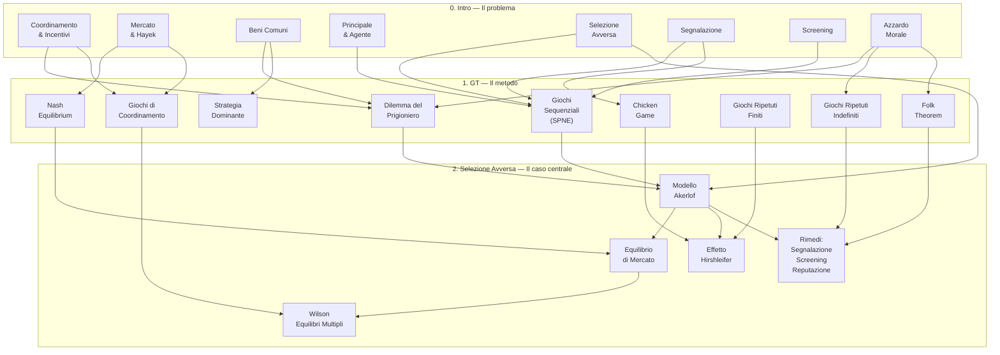

# 🗺️ Mappa Generale — Economia dell'Informazione

Questo file è il **punto di ingresso unico** del vault: collega le due sottocartelle e mostra come i concetti di ciascuna si leghino all'altra.

---

## 📁 Struttura del Vault

```
EI VAULT NOTES/
├── 00_Mappa_Generale.md   ← questo file
├── 0. Intro/              ← Concetti fondamentali (Lec 1–3)
│   └── 00_Indice.md
├── 1. GT/                 ← Teoria dei Giochi (Lec 4–5)
│   └── 00_Indice.md
└── 2. Selezione Avversa/  ← Selezione Avversa: modelli e applicazioni (Lec 6–9)
    └── 00_Indice.md
```

---

## 🧭 Filo conduttore del corso

> [!abstract] La domanda fondamentale
> Come coordinare comportamenti individuali quando l'informazione è **asimmetrica** e gli incentivi sono **in conflitto**? La Teoria dei Giochi fornisce il **linguaggio formale**; l'Economia dell'Informazione fornisce le **applicazioni economiche**.

Il corso si struttura in tre strati sovrapposti:

**Strato 1 — Il problema** (cartella `0. Intro`): cosa succede nei mercati quando l'informazione è asimmetrica? Quali istituzioni emergono? Chi vince, chi perde, e quando il mercato fallisce?

**Strato 2 — Il metodo** (cartella `1. GT`): come si formalizzano queste situazioni con la Teoria dei Giochi? Quali concetti di equilibrio si usano? Come si modella il timing, la ripetizione, la credibilità?

**Strato 3 — Il caso centrale** (cartella `2. Selezione Avversa`): come si costruisce e si risolve formalmente il modello paradigmatico dell'asimmetria informativa ex-ante? Dal mercato dei limoni di Akerlof agli equilibri multipli di Wilson, fino all'effetto Hirshleifer nei mercati assicurativi.

---

## 🔗 Tavola dei collegamenti cross-cartella

### Da `0. Intro` verso `1. GT`

| Nota (Intro) | Collegamento fondamentale (GT) | Perché |
|---|---|---|
| [[0. Intro/01_Coordinamento_e_incentivi]] | [[1. GT/06_Dilemma_Prigioniero]], [[1. GT/04_Giochi_Coordinamento]] | Le tre istituzioni risolvono giochi strategici diversi |
| [[0. Intro/02_Mercato_e_Hayek]] | [[1. GT/03_Nash_Equilibrium]], [[1. GT/04_Giochi_Coordinamento]] | Il mercato converge al NE; fallisce con equilibri multipli |
| [[0. Intro/03_Beni_comuni]] | [[1. GT/06_Dilemma_Prigioniero]], [[1. GT/01_Strategia_Dominante]] | Il dilemma del pescatore *è* un PD con defezione dominante |
| [[0. Intro/04_Principale_e_agente]] | [[1. GT/07_Giochi_Dinamici_Sequenziali]], [[1. GT/03_Nash_Equilibrium]] | Il framework P–A è un gioco sequenziale → SPNE |
| [[0. Intro/05_Selezione_avversa]] | [[1. GT/07_Giochi_Dinamici_Sequenziali]], [[1. GT/06_Dilemma_Prigioniero]] | Gioco con info asimmetrica ex ante; NE = mercato vuoto |
| [[0. Intro/06_Segnalazione]] | [[1. GT/07_Giochi_Dinamici_Sequenziali]], [[1. GT/05_Chicken_Game]] | Gioco sequenziale; segnale credibile = impegno credibile |
| [[0. Intro/07_Screening]] | [[1. GT/07_Giochi_Dinamici_Sequenziali]], [[1. GT/03_Nash_Equilibrium]] | Menù di contratti → SPNE con auto-selezione (NE) |
| [[0. Intro/08_Azzardo_morale]] | [[1. GT/06_Dilemma_Prigioniero]], [[1. GT/09_Giochi_Ripetuti_Indefiniti]], [[1. GT/10_Folk_Theorem]] | PD tra P e A; reputazione come soluzione nei giochi ripetuti |
| [[0. Intro/09_Nobel]] | [[1. GT/00_Indice]], [[1. GT/10_Folk_Theorem]] | I Nobel 2007/2012/2020 premiano teoria dei giochi applicata |

---

### Da `1. GT` verso `0. Intro`

| Nota (GT) | Applicazione in Economia dell'Informazione (Intro) | Dove |
|---|---|---|
| [[1. GT/01_Strategia_Dominante]] | Defezione nei beni comuni; shirking nell'azzardo morale | [[0. Intro/03_Beni_comuni]], [[0. Intro/08_Azzardo_morale]] |
| [[1. GT/02_Iterated_Dominance]] | Razionalità reciproca nel mechanism design; screening | [[0. Intro/07_Screening]], [[0. Intro/04_Principale_e_agente]] |
| [[1. GT/03_Nash_Equilibrium]] | Equilibrio di mercato; IC nei contratti ottimali | [[0. Intro/02_Mercato_e_Hayek]], [[0. Intro/07_Screening]] |
| [[1. GT/04_Giochi_Coordinamento]] | Fallimento del mercato; norme sociali; Hayek | [[0. Intro/01_Coordinamento_e_incentivi]], [[0. Intro/02_Mercato_e_Hayek]] |
| [[1. GT/05_Chicken_Game]] | Impegno credibile nei segnali; negoziazione | [[0. Intro/06_Segnalazione]], [[0. Intro/01_Coordinamento_e_incentivi]] |
| [[1. GT/06_Dilemma_Prigioniero]] | Commons; azzardo morale; collusione | [[0. Intro/03_Beni_comuni]], [[0. Intro/08_Azzardo_morale]] |
| [[1. GT/07_Giochi_Dinamici_Sequenziali]] | Signalling, screening, contratti P–A, credence goods | [[0. Intro/06_Segnalazione]], [[0. Intro/07_Screening]], [[0. Intro/08_Azzardo_morale]] |
| [[1. GT/08_Giochi_Ripetuti_Finiti]] | Contratti a termine; fine del gioco; paradosso P–A | [[0. Intro/08_Azzardo_morale]], [[0. Intro/03_Beni_comuni]] |
| [[1. GT/09_Giochi_Ripetuti_Indefiniti]] | Reputazione; credence goods; governance commons | [[0. Intro/08_Azzardo_morale]], [[0. Intro/03_Beni_comuni]] |
| [[1. GT/10_Folk_Theorem]] | Collusione tacita; contratti relazionali; norme sociali | [[0. Intro/08_Azzardo_morale]], [[0. Intro/03_Beni_comuni]], [[0. Intro/04_Principale_e_agente]] |

### Da `0. Intro` verso `2. Selezione Avversa`

| Nota (Intro) | Nota (Selezione Avversa) | Perché |
|---|---|---|
| [[0. Intro/04_Principale_e_agente]] | [[2. Selezione Avversa/01_Informazione_Asimmetrica_e_Caratteristiche_Nascoste\|01_Info Asimmetrica]] | Il framework P–A con tipo nascosto *è* la struttura della SA |
| [[0. Intro/05_Selezione_avversa]] | [[2. Selezione Avversa/02_Mercato_dei_Limoni_Intuizione\|02_Mercato dei Limoni]], [[2. Selezione Avversa/04_Modello_Akerlof_Formale\|04_Modello Akerlof]] | L'introduzione panoramica si espande nel modello formale |
| [[0. Intro/06_Segnalazione]] | [[2. Selezione Avversa/07_Inefficienza_e_Implicazioni\|07_Inefficienza]] | La segnalazione è uno dei rimedi alla SA identificati in 07 |
| [[0. Intro/07_Screening]] | [[2. Selezione Avversa/12_Confronto_Utilita_Equilibri_Assicurativi\|12_Confronto Utilità]] | La struttura formale dello screening coincide con la tabella delle utilità assicurative |
| [[0. Intro/02_Mercato_e_Hayek]] | [[2. Selezione Avversa/02_Mercato_dei_Limoni_Intuizione\|02_Mercato dei Limoni]] | Il mercato dei limoni *confuta* l'ipotesi di Hayek sull'aggregazione dei prezzi |
| [[0. Intro/01_Coordinamento_e_incentivi]] | [[2. Selezione Avversa/11_Assicurazione_Vita_Effetto_Distruzione\|11_Effetto Distruzione]] | L'assicurazione obbligatoria è una soluzione istituzionale al commitment problem |

### Da `1. GT` verso `2. Selezione Avversa`

| Concetto GT | Applicazione in Selezione Avversa | Note |
|---|---|---|
| [[1. GT/03_Nash_Equilibrium]] | Equilibrio $p = \mu = 0$ nel modello Akerlof = NE unico e Pareto-inferiore | [[2. Selezione Avversa/04_Modello_Akerlof_Formale\|04]], [[2. Selezione Avversa/05_Equilibrio_di_Mercato_Adverse_Selection\|05]] |
| [[1. GT/06_Dilemma_Prigioniero]] | Non-scambio nel mercato dei limoni = PD tra compratori e venditori di qualità | [[2. Selezione Avversa/02_Mercato_dei_Limoni_Intuizione\|02]], [[2. Selezione Avversa/05_Equilibrio_di_Mercato_Adverse_Selection\|05]] |
| [[1. GT/07_Giochi_Dinamici_Sequenziali]] | Timing $t=0 \to t=1 \to t=2$ = gioco in forma estesa con informazione incompleta | [[2. Selezione Avversa/01_Informazione_Asimmetrica_e_Caratteristiche_Nascoste\|01]], [[2. Selezione Avversa/03_Modello_Formale_Due_Qualita\|03]] |
| [[1. GT/04_Giochi_Coordinamento]] | Equilibri multipli Pareto-ordinabili nel modello Wilson | [[2. Selezione Avversa/09_Modello_Wilson_Equilibri_Multipli\|09]] |
| [[1. GT/09_Giochi_Ripetuti_Indefiniti]] | Reputazione come rimedio = cooperazione in giochi ripetuti con $\delta$ alto | [[2. Selezione Avversa/07_Inefficienza_e_Implicazioni\|07]] |
| [[1. GT/10_Folk_Theorem]] | Il Folk Theorem garantisce che la reputazione (qualità alta) possa essere un NE | [[2. Selezione Avversa/07_Inefficienza_e_Implicazioni\|07]] |
| [[1. GT/05_Chicken_Game]] | Commitment problem nel pooling assicurativo | [[2. Selezione Avversa/11_Assicurazione_Vita_Effetto_Distruzione\|11]] |
| [[1. GT/08_Giochi_Ripetuti_Finiti]] | Collasso del pooling volontario per backward induction | [[2. Selezione Avversa/11_Assicurazione_Vita_Effetto_Distruzione\|11]], [[2. Selezione Avversa/12_Confronto_Utilita_Equilibri_Assicurativi\|12]] |

---

## 🧩 La grande immagine: GT come linguaggio dell'EI



---

## 📖 Legenda dei riferimenti bibliografici

| Sigla | Testo |
|-------|-------|
| **[BB]** | Birchler, U. & Bütler, M. — *Information Economics*, Routledge (2007) |
| **[C]** | Carmichael, F. — *A Guide to Game Theory*, Prentice Hall |
| **[KS]** | Kerschbamer, R. & Sutter, M. — *The Economics of Credence Goods – a Survey* |
| **[M]** | Molho, I. — *The Economics of Information*, Basil Blackwell |

